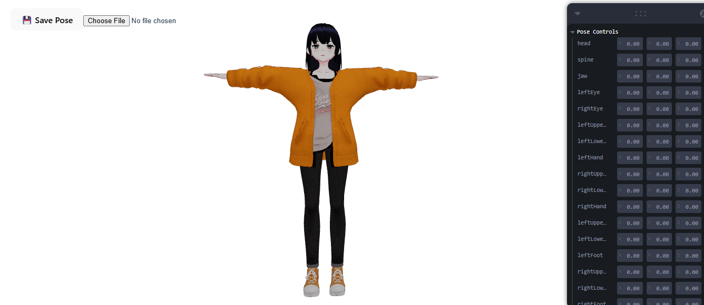

# VRM Pose Editor

VRM Pose Editor adalah aplikasi berbasis web yang memungkinkan pengguna untuk mengedit pose model VRM (Virtual Reality Model) secara interaktif. Dengan antarmuka yang mudah digunakan, pengguna dapat mengatur rotasi bagian tubuh model VRM dan melihat hasilnya secara langsung.

## Fitur

- Kontrol Interaktif: Menggunakan slider untuk mengatur rotasi bagian tubuh seperti kepala, tulang belakang, rahang, dan lengan.
- Penyimpanan dan Pemulihan Pose: Simpan pose yang telah disesuaikan ke file JSON dan muat kembali pose dari file JSON.
- Rendering Real-Time: Model VRM dirender dengan teknologi WebGL menggunakan Three.js, memberikan pengalaman visual yang realistis.
- Responsif: Antarmuka pengguna yang responsif untuk digunakan di berbagai perangkat.

## Demo

https://three-js-vrm-pose-editor.vercel.app/